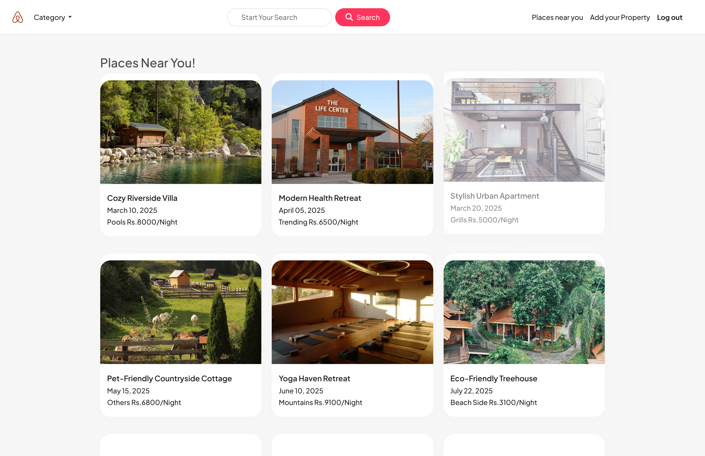

# 🏠 Airbnb Clone (MERN + MongoDB)

A full-stack Airbnb clone built using the **MERN** stack (**MongoDB, Express, React, Node.js**).  
It includes authentication, property listing creation, image uploads, reviews & ratings, and Google Maps integration.

---

## 🚀 Features
- User authentication (Login & Signup with verification)
- Create, edit, and delete property listings
- Upload images for listings
- Reviews & ratings for properties
- Google Maps integration for property locations
- MongoDB database for data storage
- Secure API with Express.js & JWT authentication

---

## 📦 Tech Stack
**Frontend:** React, Axios, Tailwind CSS  
**Backend:** Node.js, Express.js, JWT  
**Database:** MongoDB (Mongoose ODM)  
**Other:** Multer (image upload), Google Maps API

---

## 📥 Installation & Setup

### 1️⃣ Clone the Repository
```bash
git clone https://github.com/your-username/airbnb-clone.git
cd airbnb-clone
```

### 2️⃣ Install Dependencies
For **backend**:
```bash
cd server
npm install
```
For **frontend**:
```bash
cd ../client
npm install
```

### 3️⃣ Configure Environment Variables
Create a `.env` file in both **server** and **client** folders if needed.

#### **Backend `.env`**
```env
PORT=5000
MONGO_URL=your_mongodb_connection_string
JWT_SECRET=your_secret_key
```

#### **Frontend `.env`**
```env
VITE_GOOGLE_MAPS_API_KEY=your_google_maps_api_key
```

---

## ▶️ Run the App

Start backend:
```bash
cd server
npm run dev
```

Start frontend:
```bash
cd client
npm start
```

---

## 📸 Screenshots

### Home Page


### Booking Page


---

## 📄 License
This project is licensed under the MIT License.